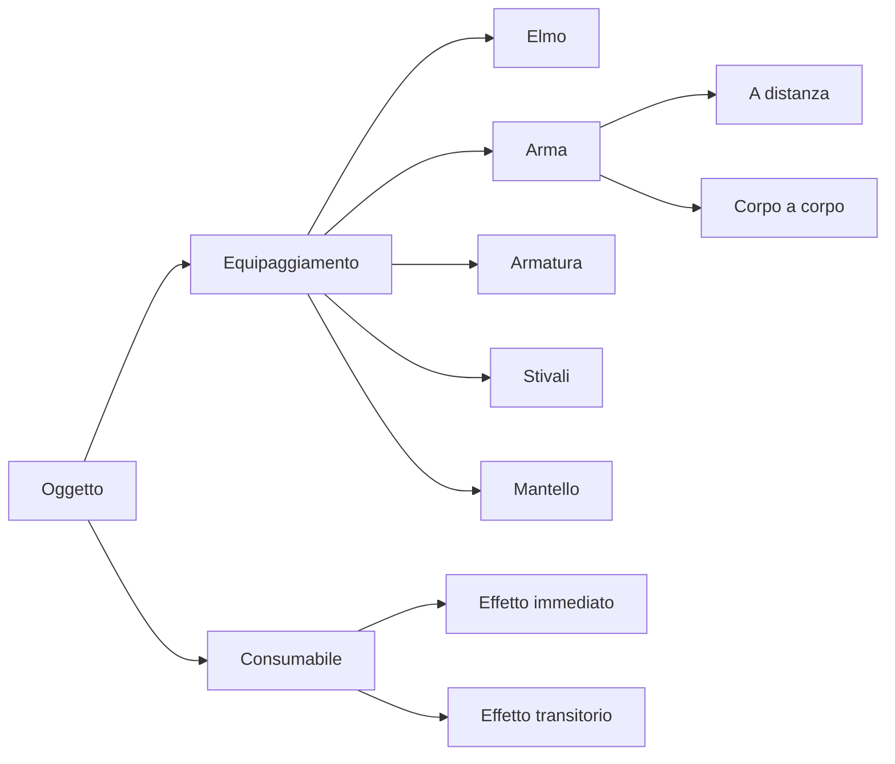

# Proposta Implementazioni aggiuintive di GDR

## Gestione dell'equipaggiamento
Creazione di una classe Equipaggiamento che gestisce quali fra gli oggetti in 
inventario è effettivamente equipaggiata, in modo che gli oggetti che danno 
effetti passivi non si cumulino tutti tra loro se hanno lo stesso tipo.
Questo porta anche a dover suddividere gli oggetti per sottocaterie :

### Consumabili e effetti

Strutturiamo maggiormente i consumabili e gli effetti :
Gli effetti possono dividersi per effetto durata e potrebbero non derivare solo dall'uso 
di consumabili.

## Nuova Classe : Effetto
Un effetto garantisce bonus o malus o causa un cambiamento nello svolgersi dei turni
Ha una durata (in round).

Effetti: (Qua si potrebbero usare gli Enum)
- Arrabbiato (+tot ai danni max , ma può solo attaccare)
- Pietrificato (non può compiere azioni per un certo numero di turni)
- Avvelenato (Perde salute all'inizio di ogni round)

## Aggiunta di mostri tra i nemici
Possiamo tranquillamente trattarli come classi a cui il giocatore però non ha accesso
I mostri hanno attacchi speciali (override di attacco) che può imporre effetti 
- Medusa (Potrebbe imporre l'effetto pietrificato)
- Vipera Gigante (Potrebbe imporre l'effetto Avvelenato)

## Maggior specializzazione delle classi 
Potremmo rendere le classi piu particolari e interessanti aggiungendo azioni speciali 
che solo una determinata classe può usare :
- Ladro (Fuga : può fuggire dallo scontro e cambiare nemico interrompendo il duello, e borseggiare rubando oggetti dall'inventario del nemico)
- Mago (Puo avere a disposizione diversi incantesimi che garantiscono effetti a te o al nemico)
- Guerriero (Bho non saprei a me i guerrieri non piacciono sono banali)

### Dotiamo i nemici di una rudimentale IA
Ora come ora i nemici non usano i loro oggetti e possono solo attaccare 
possiamo far si che scelgano una azione a caso fra quelle a loro disponibili(Inizialmente)

V(2) Potremmo dare ai nemici un briciolo di intelligenza permettendogli di scegliere di attaccare se 
il personaggio è già con salute bassa o buffarsi se è a salute alta 

### Eventi casuali 
Vi è mai capitato che una torma di goblin ubriachi investesse voi e il vostro 
avversario cambiando le sorti di uno scontro ?
Potremmo introdurre possibilità basse che durante un round succeda qualcosa di imprevisto
garantendo un effetto a uno o entrambi gli sfidandi , o cambiando il nemico di punto in bianco

### Level Up 
E quindi gestione dei punti esperienza , le classi sbloccano nuove capacità salendo di livello
(oltre ad aumentare le caratteristiche)

### Salvataggio e persistenza della partita su Json

Salviamo le variabili sufficienti a recuperare l'esecuzione del gioco in un secondo momento dal punto in cui abbiamo interrotto
Ora che abbiamo oggetti e funzioni sarà pi semplice

