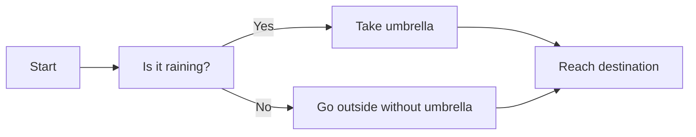
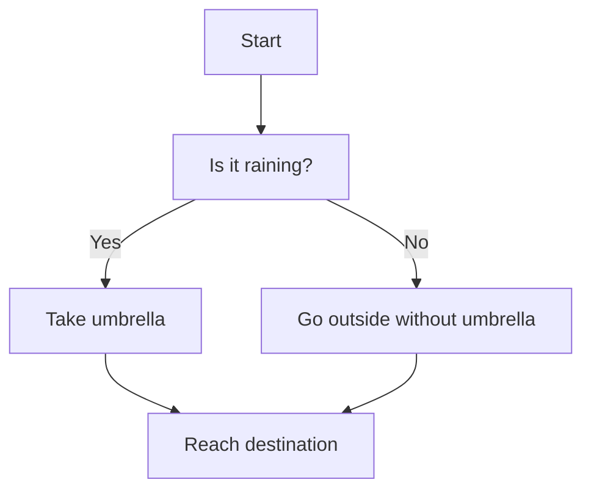
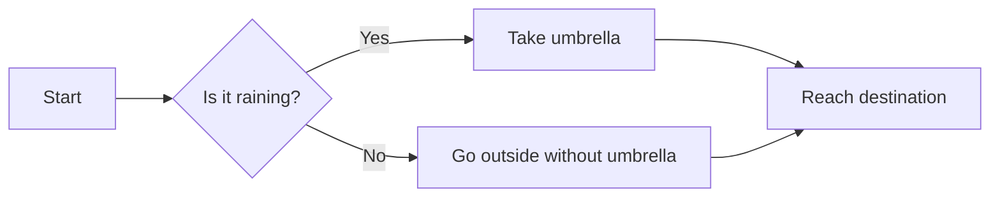

# Meremaid

E' uno strumento utile e potente che aiuta a redigere la documentazione

l'utilità della documentazione consiste nell'aiutarci e nell'aiutare a riprendere il lavoro interrotto da pause dettate 
da impellenze maggiori o per riprendere il lavoro lasciato interrotto da un altro developer
Mermaid è opensource
Gli serve l'estensione github markdown preview
trovi la documentazione dettagliata su Mermaid chart [Documentazione semplificata](https://www.mermaidchart.com/)
o piu completa su [Documentazione completa](https://mermaid.js.org/syntax/flowchart.html)

Noi vedremo quasi solo i Flow chart (Diagrammi di flusso)
Entity Relationship Diagram (Per i DB)
I diagrammi di Gant per le timeline

Esempio di flow chart LR(left to right) :

Esempio di flow chart TB(Top Bottom) :

Answers :

Nota : Occhio agli spazi B[blabla] deve essere tutto attaccato